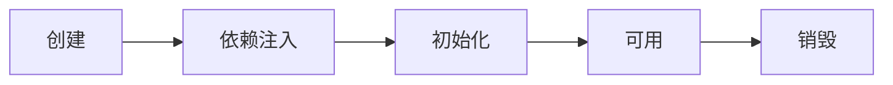
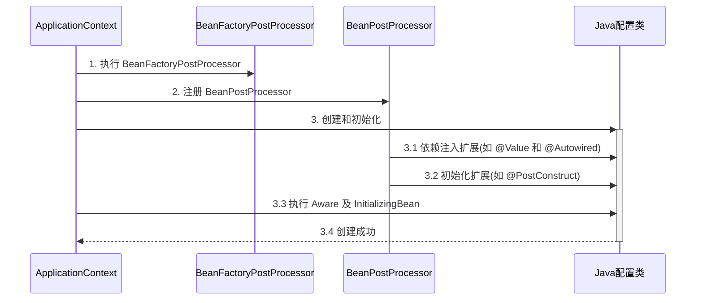
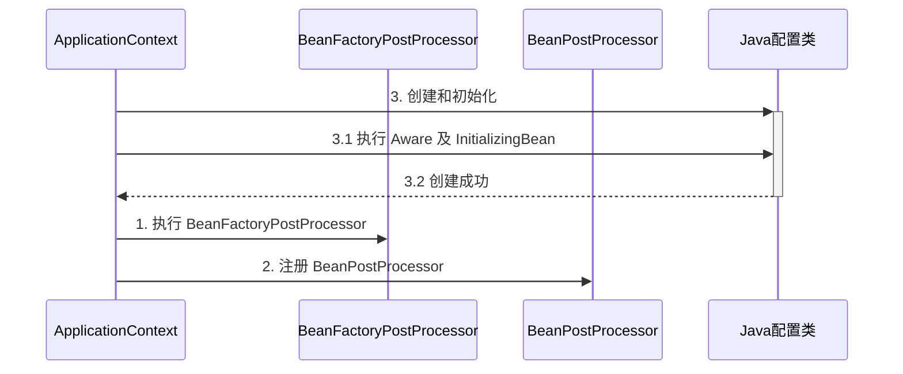

# Spring

## 容器和bean

### 容器接口

#### BeanFactory

* 典型功能有：getBean
* 它是 ApplicationContext 的父接口
* 它才是 Spring 的核心容器, 主要的 ApplicationContext 实现都【组合】了它的功能，【组合】是指 ApplicationContext
  的一个重要成员变量就是 BeanFactory
* 用途：实际上控制反转、基本的依赖注入、直至 Bean 的生命周期的各种功能，都由它的实现类`DefaultListableBeanFactory`提供

#### ApplicationContext

* 是 BeanFactory 的子接口。组合并扩展了 BeanFactory 的功能
* 如国际化(getMessage)、通配符方式获取一组 Resource 资源(getResource)、整合 Environment 环境(getEnvironment)
  、事件发布与监听(publishEvent)
* 新学一种代码之间解耦途径，事件解耦

### 容器实现

#### BeanFactory

* beanFactory 可以通过 `registerBeanDefinition` 注册一个 **bean definition 对象**
    * 我们平时使用的配置类、xml、组件扫描等方式都是生成 bean definition 对象注册到 beanFactory 当中
    * bean definition 描述了这个 bean 的创建蓝图：scope 是什么、用构造还是工厂创建、初始化销毁方法是什么，等等
* beanFactory 没那么完善，需要手动调用 `beanFactory 后处理器`对它做增强
    * 例如通过解析 @Bean、@ComponentScan 等注解，来补充一些 bean definition
* beanFactory 需要手动添加 `bean 后处理器`，以便对后续 bean 的创建过程提供增强
    * 例如 @Autowired，@Resource 等注解的解析都是 bean 后处理器完成的
    * bean 后处理的添加顺序会对解析结果有影响，见视频中同时加 @Autowired，@Resource 的例子
* beanFactory 需要手动调用方法来初始化单例
* beanFactory 需要额外设置才能解析 ${} 与 #{}

**❗bean后置处理器和bean工厂后置处理器不同❗**

#### ApplicationContext

1. 常见的 ApplicationContext 容器实现（一共四种）
2. 内嵌容器、DispatcherServlet 的创建方法、作用

### Bean生命周期

#### 生命周期流程

一个受 Spring 管理的 bean，生命周期主要阶段有

1. 创建：根据 bean 的构造方法或者工厂方法来创建 bean 实例对象
2. 依赖注入：根据 @Autowired，@Value 或其它一些手段，为 bean 的成员变量填充值、建立关系
3. 初始化：回调各种 Aware 接口，调用对象的各种初始化方法
4. 销毁：在容器关闭时，会销毁所有单例对象（即调用它们的销毁方法，prototype 对象也能够销毁，不过需要容器这边主动调用



#### 增强器

- 创建前后的增强

    - `postProcessBeforeInstantiation`：这里返回的对象若不为 null 会替换掉原本的 bean，并且仅会走
      postProcessAfterInitialization 流程
    - `postProcessAfterInstantiation`：这里如果返回 false 会跳过依赖注入阶段
- 依赖注入前的增强：
    - `postProcessProperties`： @Autowired、@Value、@Resource
- 初始化前后的增强：
    - `postProcessBeforeInitialization`：这里返回的对象会替换掉原本的 bean，如 @PostConstruct、@ConfigurationProperties
    - `postProcessAfterInitialization`：这里返回的对象会替换掉原本的 bean，如代理增强
- 销毁之前的增强：
    - `postProcessBeforeDestruction`： @PreDestroy

#### 模板方法设计模式

* 模板方法设计模式：把一个算法的不变部分抽象到父类，把可变部分留给子类实现
* 在`TestMethodTemplate.java`中，就是把添加 bean 后置处理器给抽象出来，可以 inject 不同的 bean

```java
public class TestMethodTemplate {

    public static void main(String[] args) {
        MyBeanFactory beanFactory = new MyBeanFactory();
        beanFactory.addBeanPostProcessor(bean -> System.out.println("解析 @Autowired"));
        beanFactory.addBeanPostProcessor(bean -> System.out.println("解析 @Resource"));
        beanFactory.getBean();
    }

    // 模板方法  Template Method Pattern
    static class MyBeanFactory {
        public Object getBean() {
            Object bean = new Object();
            System.out.println("构造 " + bean);
            System.out.println("依赖注入 " + bean); // @Autowired, @Resource
            for (BeanPostProcessor processor : processors) {
                processor.inject(bean);
            }
            System.out.println("初始化 " + bean);
            return bean;
        }

        private List<BeanPostProcessor> processors = new ArrayList<>();

        public void addBeanPostProcessor(BeanPostProcessor processor) {
            processors.add(processor);
        }
    }
    
    static interface BeanPostProcessor {
        public void inject(Object bean); // 对依赖注入阶段的扩展
    }
}
```

### Bean 后处理器

Bean后置处理器：为Bean生命周期各个阶段提供扩展功能

#### 种类

* `AutowiredAnnotationBeanPostProcessor` 解析 @Autowired 与 @Value
* `CommonAnnotationBeanPostProcessor` 解析 @Resource、@PostConstruct、@PreDestroy
* `ConfigurationPropertiesBindingPostProcessor` 解析 @ConfigurationProperties
* `ContextAnnotationAutowireCandidateResolver` 负责获取 @Value 的值，解析 @Qualifier、泛型、@Lazy 等

#### 具体解析过程

1. AutowiredAnnotationBeanPostProcessor.findAutowiringMetadata 用来获取某个 bean 上加了 @Value
   @Autowired的成员变量，方法参数的信息，表示为 `InjectionMetadata`
2. `InjectionMetadata` 可以完成依赖注入
3. `InjectionMetadata` 内部根据成员变量，方法参数封装为 `DependencyDescriptor` 类型
4. 有了 `DependencyDescriptor`，就可以利用 beanFactory.`doResolveDependency` 方法进行基于类型的查找

### BeanFactory 后处理器

主要后处理器：就是补充了一些Bean的定义，完成这些注解的扩展功能

#### 种类

- `ConfigurationClassPostProcessor`可以解析
    - @ComponentScan
    - @Bean
    - @Import
    - @ImportResource
- `MapperScannerConfigurer` 可以解析
    - Mapper 接口

#### 其他

1. Spring 操作元数据的工具类 `CachingMetadataReaderFactory`
2. 通过注解元数据（`AnnotationMetadata`）获取直接或间接标注的注解信息
3. 通过类元数据（ClassMetadata）获取类名，`AnnotationBeanNameGenerator` 生成 bean 名
4. 解析元数据是基于 ASM 技术【TODO：这个还不太了解】

### Aware 接口

#### 种类

1. `Aware` 接口提供了一种【内置】 的注入手段，例如
    * `BeanNameAware` 注入 bean 的名字
    * `BeanFactoryAware` 注入 BeanFactory 容器
    * `ApplicationContextAware` 注入 ApplicationContext 容器
    * `EmbeddedValueResolverAware` 注入 ${} 解析器
2. `InitializingBean` 接口提供了一种【内置】的初始化手段

#### 和@Autowried实现注入 对比

* 内置的注入和初始化不受扩展功能的影响，总会被执行
* 而(@Autowried实现的)
  扩展功能受某些情况影响可能会失效，比如说没加bean后置处理器`AutowiredAnnotationBeanPostProcessor`、`CommonAnnotationBeanPostProcessor`
* 因此 Spring 框架内部的类常用内置注入和初始化

#### @Autowired 失效分析



使用自定义的`BeanFactoryPostProcessor`
会导致Bean的创建流程先开始第三步Java配置类，从而导致`BeanPostProcessor`以及一些依赖注入等拓展功能还没有及时完成



### 初始化与销毁

三种初始化Bean方法：1. @PostConstruct 2. 实现InitializingBean接口 3. @Bean(initMenthod = "init3")

如果同一个 bean 用了以上手段声明了 3 个初始化方法，那么它们的执行顺序是

1. @PostConstruct 标注的初始化方法
2. InitializingBean 接口的初始化方法
3. @Bean(initMethod="xxxx") 指定的初始化方法

与初始化类似，Spring 也提供了多种销毁手段，执行顺序为

1. @PreDestroy 标注的销毁方法
2. DisposableBean 接口的销毁方法
3. @Bean(destroyMethod="xxxx") 指定的销毁方法

### Scope

#### Scope 类型

在当前版本的 Spring 和 Spring Boot 程序中，支持五种 Scope

* singleton，**容器启动**时创建（未设置延迟），容器关闭时销毁
* prototype，**每次使用**时创建，不会自动销毁，需要调用 `DefaultListableBeanFactory.destroyBean(bean)` 销毁
* request，**每次请求**用到此 bean 时创建，请求结束时销毁
* session，**每个会话**用到此 bean 时创建，会话结束时销毁
* application，**web 容器**用到此 bean 时创建，容器停止时销毁

#### scope 失效解决办法

但要注意，如果在 singleton 注入其它 scope 都会有问题，解决方法有

* @Lazy【在被注入类】
* @Scope(proxyMode = ScopedProxyMode.TARGET_CLASS)【在注入目标上】
* ObjectFactory<class>
* 注入ApplicationContext.getBean


## AOP